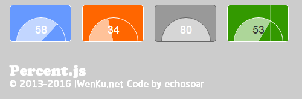

#Mools
*Mools通用前端组件库，提供基本组件以及复杂组件，持续更新中*

```html
<!--

                          _oo0oo_
                         o8888888o
                         88" . "88
                         (| -_- |)
                         0\  =  /0
                       ___/`---'\___
                     .' \\|     |// '.
                    / \\|||  :  |||// \
                   / _||||| -:- |||||_ \
                  |   | \\\  -  /// |   |
                  | \_|  ''\---/''  |_/ |
                  \  .-\__  '-'  __/-.  /
                ___'. .'  /--.--\  `. .'___
             ."" '<  `.___\_<|>_/___.' >' "".
            | | :  `- \`.;`\ _ /`;.`/ - `  : | |
            \  \ `_.   \_ __\ /__ _/    .-` /  /
        =====`-.____`.___ \_____/ ___.-`___.-'=====
                          `=---='

-->
```
###基本组件 Basic UI Element
***
#####Gdivider
*可以设置中央文字的水平分割线组件*


传送门->[Gdivider](https://github.com/echosoar/mools/tree/basicUIElement/gdivider)
***

#####GOA : GOffsetAnimate
*可以设置偏移量的元素渐进渐隐组件*

传送门->[GOA](https://github.com/echosoar/mools/tree/master/basicUIElement/goa)
***
#####GFPS
*检测浏览器的帧频FPS，以便于浏览器的动画等使用*

传送门->[GFPS](https://github.com/echosoar/mools/tree/master/basicUIElement/gfps.js)
***
#####basementChildCount
*获取某个结点的第一层某个类型子元素数量，比如从多层ul、li嵌套中获取第一层li结点的数量*

传送门->[BCC](https://github.com/echosoar/mools/tree/master/basicUIElement/basementChildCount.html)
***
#####GStyle
*获取某个元素的某个属性值（无论是内嵌style还是外联样式）*

传送门->[GStyle](https://github.com/echosoar/mools/tree/master/basicUIElement/gstyle)
***
#####scrollCheck.js
*侦听浏览器滚动条滚动，并返回页面距离顶部和底部位置*

传送门->[scrollCheck](https://github.com/echosoar/mools/tree/master/basicUIElement/scrollCheck.js)
***
#####Grem.js
*自动适应浏览器，改变根元素fontSize，使得页面宽度为10rem*

传送门->[Grem.js](https://github.com/echosoar/mools/tree/master/basicUIElement/grem.js)
***
#####toCSS
*传入任意一个元素节点，返回能够获取到这个结点的CSS选择器*

例如：

> html body div:nth-child(2) div#aaa.bbb.ccc.dd:first-child

> html body div:first-child div#aaa.bbb.ccc.dd:last-child

> html body p a#aaa:last-child

传送门->[toCSS](https://github.com/echosoar/mools/tree/master/basicUIElement/toCSS.html)
***
#####percent.js
*一个创新型的简单易用数字选择组件*



使用方法：
```html 
 <gpercent from=0 to=80 now=10 width="100px" border="1px solid #fff" callback=alert></gpercent>
```

传送门->[percent.js](https://github.com/echosoar/mools/tree/master/basicUIElement/percent.js)
***
#####GDebounce.js
*一个防抖与节流组件*

传送门->[GDebounce.js](https://github.com/echosoar/mools/tree/master/basicUIElement/gdebounce/)
***
#####digitalGenerator.js
*一个三次贝塞尔数字生成器，为动画提供支持的组件*

传送门->[digitalGenerator.js](https://github.com/echosoar/mools/tree/master/basicUIElement/digitalGenerator)
***

###复杂组件 Complex UI Element
***
#####FileUploader
*基于ajax和HTML的FileReaderAPI的文件异步上传*

>@parem onload(response text):when upload success

>@parem onprogress(nowUploadedSize,totalSize)

>@parem onerror(readyState,httpStatus):when upload error

传送门->[FileUploader](https://github.com/echosoar/mools/tree/complexUIElement/fileuploader)
***
#####GDate
*原生Javascript日期选择组件，兼容PC已经移动端主流Browser*

传送门->[GDate](https://github.com/echosoar/gdate)
***
#####GLighter
*原生Javascript的代码高亮组件，目前已支持HTML、CSS以及Javascript的代码高亮*

传送门->[GLighter](https://github.com/echosoar/glighter)
***

